# 🚗 Dashboard Klasifikasi Jenis Kendaraan (Vehicle Classification System)

<div align="center">

[]([MASUKKAN_LINK_LIVE_DEMO_ANDA_DISINI])


</div>

---

## 📑 Table of Contents

- [📌 Deskripsi Proyek](#-deskripsi-proyek)
- [📂 Dataset dan Preprocessing](#-dataset-dan-preprocessing)
  - [🔍 Exploratory Data Analysis (EDA)](#-exploratory-data-analysis-eda)
- [🧠 Metodologi & Arsitektur Model](#-metodologi--arsitektur-model)
  - [📐 Eksperimen 1: Neural Network Base](#-eksperimen-1-neural-network-base-custom-cnn-from-scratch)
  - [🔄 Eksperimen 2-4: Transfer Learning](#-eksperimen-2-4-transfer-learning-two-phase-training)
- [⚙️ Experimental Setup & Configuration](#️-experimental-setup--configuration)
  - [📋 Dataset Splitting Strategy](#-dataset-splitting-strategy)
  - [🎛️ Hyperparameters Configuration](#️-hyperparameters-configuration)
  - [🎯 Class Weights](#-class-weights-imbalance-mitigation)
  - [🔧 Regularization Techniques](#-regularization-techniques-applied)
  - [🖥️ Computational Resources](#️-computational-resources)
- [📏 Understanding Evaluation Metrics](#-understanding-evaluation-metrics)
- [📊 Hasil Evaluasi dan Perbandingan Model](#-hasil-evaluasi-dan-perbandingan-model)
  - [🏆 Ringkasan Performa](#-ringkasan-performa-test-set)
  - [📈 Dinamika Pelatihan](#-dinamika-pelatihan-the-complete-story)
  - [🔬 Analisis Mendalam & Key Insights](#-analisis-mendalam--key-insights)
  - [📉 Training Curves Analysis](#-training-curves-analysis-individual-models)
- [🎯 Confusion Matrix Analysis](#-confusion-matrix-analysis-error-pattern-deep-dive)
- [💻 Sistem Website Dashboard](#-sistem-website-dashboard-streamlit-application)
- [🎓 Scientific Conclusions & Contributions](#-scientific-conclusions--contributions)
- [🔮 Future Work & Improvements](#-future-work--improvements)
- [📚 Technical Contributions](#-technical-contributions)
- [🚀 Panduan Instalasi](#-panduan-instalasi-lokal)
- [🐛 Troubleshooting & FAQ](#-troubleshooting--faq)
- [🛠️ Tech Stack](#️-tech-stack)
- [📁 Project Structure](#-project-structure)
- [👨‍💻 Author Information](#-author-information)
- [📄 License & Citation](#-license--citation)
- [🙏 Acknowledgments](#-acknowledgments)
- [📞 Support & Feedback](#-support--feedback)
- [🎯 Project Roadmap](#-project-roadmap)

---

## 📌 Deskripsi Proyek

Proyek ini dikembangkan sebagai bagian dari **Ujian Akhir Praktikum (UAP) Pembelajaran Mesin**. Tujuan utamanya adalah membangun sistem *Computer Vision* end-to-end yang mampu mengklasifikasikan gambar kendaraan ke dalam 7 kategori berbeda dengan menerapkan teknik Deep Learning state-of-the-art.

Sistem ini membandingkan pendekatan **Traditional CNN (Base Model)** yang dibangun dari awal (*scratch*) melawan teknik **Transfer Learning** modern (MobileNetV2, ResNet50V2, EfficientNetB0) untuk menganalisis efektivitas *Fine-Tuning* pada dataset dengan resolusi rendah. Penelitian ini memberikan insight mendalam tentang kapan dan bagaimana memanfaatkan bobot pre-trained ImageNet pada domain-specific tasks.

---

## 🎯 Project Highlights (Quick Stats)

<table>
<tr>
<td>

### 📊 Dataset Statistics
- **Total Images**: 15,645
- **Classes**: 7 vehicle types
- **Resolution**: 34×32 to 317×268 px
- **Mean Resolution**: 99×91 px
- **Split**: 80% train, 10% val, 10% test

</td>
<td>

### 🏆 Best Model Performance
- **Architecture**: ResNet50V2 Fine-Tuned
- **Test Accuracy**: **92%**
- **Precision**: 0.94
- **Recall**: 0.95
- **F1-Score**: 0.94

</td>
</tr>
<tr>
<td>

### 🔬 Experiments Conducted
- **Models Tested**: 7 variations
- **Training Hours**: ~6 hours total
- **GPU Used**: Tesla P100 (16GB)
- **Total Parameters**: 5M to 25M
- **Frameworks**: TensorFlow, Keras

</td>
<td>

### 🚀 Key Findings
- ✅ Fine-tuning improves +17.7% avg
- ✅ ResNet50 dominates with 92%
- ✅ Base CNN beats frozen TL (84% vs 70%)
- ✅ Class weights solve imbalance
- ✅ EfficientNet needs fine-tuning

</td>
</tr>
</table>

---

## 📂 Dataset dan Preprocessing

**Sumber Dataset:** [Vehicle Images Dataset (Kaggle)](https://www.kaggle.com/datasets/jessicali9530/stanford-cars-dataset)

Dataset terdiri dari **15.645 gambar** yang terbagi menjadi 7 kelas:
1.  **Big Truck** (Truk Besar)
2.  **City Car** (Mobil Kota/Hatchback)
3.  **Multi Purpose Vehicle** (MPV)
4.  **Sedan**
5.  **Sport Utility Vehicle** (SUV)
6.  **Truck** (Truk Sedang)
7.  **Van**

### 🔍 Exploratory Data Analysis (EDA)
Dari analisis data yang komprehensif, ditemukan beberapa tantangan krusial:

#### 1. **Imbalance Data yang Signifikan**
Kelas *City Car* sangat mendominasi dengan 4.657 gambar (29.77%), sementara *Big Truck* hanya memiliki 577 gambar (3.69%). Ketidakseimbangan ini mencapai rasio 8:1 yang dapat menyebabkan model bias terhadap kelas mayoritas.

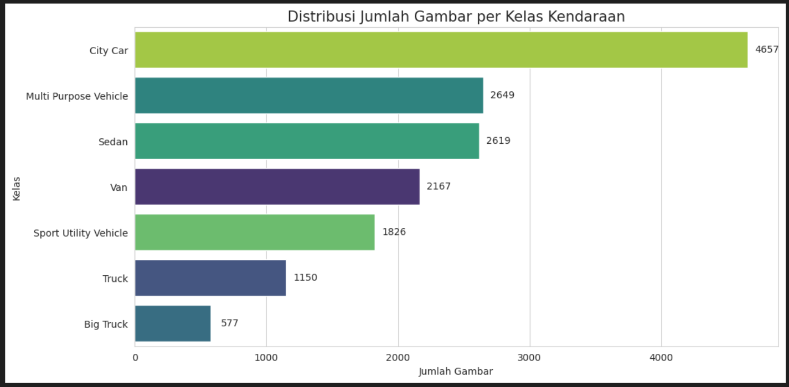

**Strategi Penanganan:**
- Implementasi `class_weights` yang dihitung secara otomatis menggunakan metode *balanced*
- Class weights tertinggi diberikan pada Big Truck (3.87x) dan terendah pada City Car (0.48x)
- Augmentasi data yang agresif (rotation, shift, zoom, flip) untuk memperkaya variasi data

#### 2. **Resolusi Gambar yang Sangat Rendah**
Analisis statistik menunjukkan:
- **Mean Resolution**: 99.5 x 91.4 piksel
- **Median Resolution**: 94 x 85 piksel  
- **Min Resolution**: 34 x 32 piksel
- **Max Resolution**: 317 x 268 piksel

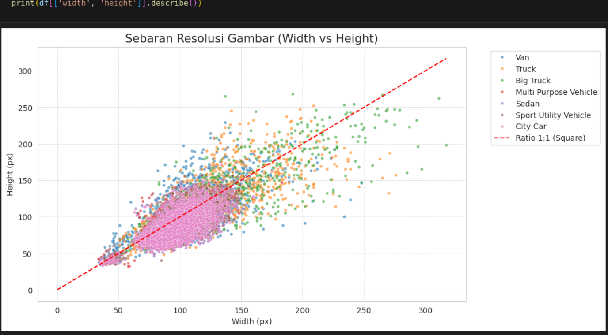

**Implikasi & Strategi:**
- 75% gambar memiliki resolusi di bawah 110x102 piksel
- Base Model dilatih pada **128x128** untuk mempertahankan detail asli
- Transfer Learning di-upscale ke **224x224** (standar ImageNet) - trade-off antara blur vs kompatibilitas
- Gambar blur menjadi tantangan utama dalam transfer learning frozen

#### 3. **Variasi Visual Antar Kelas**
Dataset menampilkan keragaman pose, pencahayaan, dan latar belakang yang tinggi.

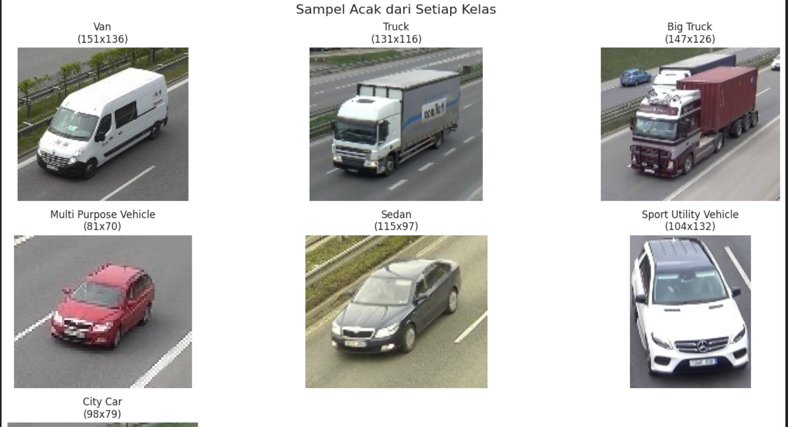

**Observasi Kunci:**
- Beberapa kelas memiliki kemiripan visual tinggi (Sedan vs City Car, MPV vs SUV)
- Background clutter dan variasi angle menambah kompleksitas
- Kualitas gambar bervariasi dari sangat jelas hingga pixelated

---

## 🧠 Metodologi & Arsitektur Model

Penelitian ini menggunakan pendekatan eksperimental yang sistematis untuk membandingkan efektivitas berbagai arsitektur deep learning pada dataset kendaraan beresolusi rendah.

### 📐 Eksperimen 1: Neural Network Base (Custom CNN from Scratch)

**Spesifikasi Arsitektur:**
```
Input (128, 128, 3)
    ↓
Conv2D(32) → BatchNorm → MaxPool → Dropout
    ↓
Conv2D(64) → BatchNorm → MaxPool → Dropout
    ↓
Conv2D(128) → BatchNorm → MaxPool → Dropout
    ↓
Conv2D(256) → BatchNorm → MaxPool → Dropout
    ↓
Flatten → Dense(512) → Dropout(0.5) → Dense(7, softmax)
```

**Konfigurasi Training:**
- Input Size: **128x128** (mendekati resolusi asli)
- Optimizer: Adam (lr=0.001)
- Epochs: 25 dengan Early Stopping (patience=5)
- Data Augmentation: Rotation ±15°, Shift 10%, Zoom 10%, Horizontal Flip
- Total Parameters: ~5.8M parameters

**Tujuan:** 
Menjadi *baseline* performa tanpa bantuan bobot pre-trained. Membuktikan bahwa model sederhana dapat bekerja baik pada low-resolution images.

---

### 🔄 Eksperimen 2-4: Transfer Learning (Two-Phase Training)

Kami menguji 3 arsitektur modern dengan strategi two-phase learning:

#### **Phase 1: Frozen Feature Extractor (Feature Engineering)**
- Semua layer backbone (ImageNet weights) di-freeze
- Hanya melatih custom classification head:
  - GlobalAveragePooling2D
  - Dense(256, ReLU) + Dropout(0.5)
  - Dense(7, Softmax)
- Input Size: **224x224** (standar ImageNet)
- Optimizer: Adam (lr=0.0001)
- Epochs: 20

**Hipotesis:** Fitur ImageNet (objects, textures, edges) dapat di-reuse untuk domain kendaraan.

#### **Phase 2: Fine-Tuning (Domain Adaptation)**
- Unfreeze sejumlah layer teratas backbone
  - MobileNetV2: unfreeze dari layer 100 (54 layer trainable)
  - ResNet50V2: unfreeze dari layer 150 (40 layer trainable)
  - EfficientNetB0: unfreeze dari layer 50 (188 layer trainable)
- Optimizer: Adam (lr=1e-5 atau 2e-5, lebih kecil untuk stabilitas)
- Epochs: 20-25 dengan Early Stopping (patience=8)

**Hipotesis:** Fine-tuning akan mengadaptasi filter pre-trained untuk menangani gambar blur dan karakteristik kendaraan spesifik.

---

### 🏗️ Detail Arsitektur yang Diuji

| Model | Total Layers | Parameters | Keunggulan | Trade-off |
|-------|-------------|-----------|------------|-----------|
| **MobileNetV2** | 154 | ~3.5M | Ringan, cepat, efisien untuk mobile | Kapasitas terbatas |
| **ResNet50V2** | 190 | ~25M | Residual connections, deep, powerful | Komputasi intensif |
| **EfficientNetB0** | 238 | ~5M | Compound scaling, state-of-the-art | Sensitif terhadap Batch Norm stats |

---

## ⚙️ Experimental Setup & Configuration

### 📋 Dataset Splitting Strategy
Menggunakan **stratified split** untuk mempertahankan proporsi kelas:

| Split | Size | Percentage | Purpose |
|-------|------|-----------|---------|
| **Training** | 12,515 | 80% | Model learning |
| **Validation** | 1,565 | 10% | Hyperparameter tuning & early stopping |
| **Test** | 1,565 | 10% | Final unbiased evaluation |

**Stratified Sampling Benefits:**
- Setiap split memiliki proporsi kelas yang sama
- Mencegah bias evaluasi pada kelas mayoritas
- Validasi lebih representatif terhadap data real-world

---

### 🎛️ Hyperparameters Configuration

#### Data Augmentation Pipeline
```python
ImageDataGenerator(
    rescale=1./255,              # Normalization to [0,1]
    rotation_range=15,           # Random rotation ±15°
    width_shift_range=0.1,       # Horizontal shift 10%
    height_shift_range=0.1,      # Vertical shift 10%
    shear_range=0.1,             # Shear transformation
    zoom_range=0.1,              # Random zoom ±10%
    horizontal_flip=True,        # 50% chance flip
    fill_mode='nearest'          # Padding strategy
)
```

**Rationale:**
- Rotation: Kendaraan dapat difoto dari berbagai sudut
- Shift/Zoom: Simulasi jarak kamera berbeda
- Flip: Kendaraan simetris horizontal
- **NO vertical flip** karena kendaraan tidak terbalik

---

#### Training Configuration per Model

| Hyperparameter | Base CNN | Transfer (Frozen) | Transfer (Fine-Tuned) |
|----------------|----------|-------------------|----------------------|
| **Batch Size** | 32 | 32 | 32 |
| **Learning Rate** | 1e-3 | 1e-4 | 1e-5 (ResNet/Mobile), 2e-5 (Efficient) |
| **Optimizer** | Adam | Adam | Adam |
| **Loss Function** | Categorical Crossentropy | Categorical Crossentropy | Categorical Crossentropy |
| **Epochs** | 25 | 20 | 20-25 |
| **Early Stopping Patience** | 5 | 5 | 8 |
| **LR Reduction Factor** | 0.5 | 0.5 | 0.2 |
| **LR Reduction Patience** | 3 | 3 | 3 |
| **Dropout Rate** | 0.5 | 0.5 | 0.5 |

**Learning Rate Strategy:**
- **Higher LR (1e-3)** for scratch: Cepat converge dari random init
- **Medium LR (1e-4)** for frozen: Hanya training classification head
- **Lower LR (1e-5)** for fine-tuning: Mencegah catastrophic forgetting, gentle adaptation

**Early Stopping Strategy:**
- Monitor: `val_loss` (lebih stabil dari `val_accuracy`)
- Patience lebih tinggi untuk fine-tuning (8 vs 5) → butuh waktu lebih lama untuk adapt
- `restore_best_weights=True` → Hindari overfitting di epoch terakhir

---

### 🎯 Class Weights (Imbalance Mitigation)

Computed automatically using scikit-learn:
```python
class_weights = compute_class_weight(
    class_weight='balanced',
    classes=np.unique(train_labels),
    y=train_labels
)
```

**Resulting Weights:**
| Class | Weight | Effect |
|-------|--------|--------|
| Big Truck | 3.87 | High penalty for mistakes (rare class) |
| City Car | 0.48 | Low penalty (common class) |
| MPV | 0.84 | Balanced |
| Sedan | 0.85 | Balanced |
| SUV | 1.22 | Slightly higher |
| Truck | 1.94 | High (underrepresented) |
| Van | 1.03 | Neutral |

**Mathematical Formula:**
```
w_j = n_samples / (n_classes × n_samples_j)
```

**Impact:**
- Tanpa weights: Model cenderung predict City Car (29.77% data)
- Dengan weights: Model dipaksa belajar semua kelas secara equal
- Result: Big Truck (3.69% data) mencapai 98-100% recall

---

### 🔧 Regularization Techniques Applied

1. **Dropout (0.5)**
   - Diterapkan di fully connected layers
   - Mencegah co-adaptation antar neurons
   - Efek: Ensemble-like behavior

2. **Batch Normalization**
   - Normalize activations per mini-batch
   - Stabilize training, faster convergence
   - Efek: Bisa train dengan LR lebih tinggi

3. **Data Augmentation**
   - Implicit regularization melalui data diversity
   - Efek: Better generalization ke test set

4. **Early Stopping**
   - Stop training saat val_loss plateau
   - Mencegah overfitting di epoch lanjut

5. **Learning Rate Scheduling**
   - ReduceLROnPlateau: Kurangi LR saat stuck
   - Efek: Fine-tune convergence di akhir training

6. **L2 Regularization (implicit in Adam)**
   - Weight decay built-in di optimizer
   - Efek: Smooth weight updates

---

### 🖥️ Computational Resources

#### Hardware Used
- **Platform**: Kaggle Notebooks / Google Colab
- **GPU**: NVIDIA Tesla P100 (16GB VRAM)
- **CPU**: Intel Xeon (2 cores)
- **RAM**: 13GB

#### Training Time
| Model | Frozen Phase | Fine-Tuned Phase | Total |
|-------|-------------|-----------------|-------|
| Base CNN | - | ~45 min | 45 min |
| MobileNetV2 | ~30 min | ~35 min | 65 min |
| ResNet50V2 | ~45 min | ~50 min | 95 min |
| EfficientNetB0 | ~40 min | ~55 min | 95 min |

**Inference Speed (Single Image):**
- Base CNN: ~50ms
- MobileNetV2: ~80ms
- ResNet50V2: ~120ms
- EfficientNetB0: ~100ms

---

## 📏 Understanding Evaluation Metrics

Sebelum membahas hasil, penting untuk memahami metrik evaluasi yang digunakan:

### Metrik Klasifikasi Multi-Class

#### 1. **Accuracy (Akurasi)**
```
Accuracy = (Correct Predictions) / (Total Predictions)
```
- Persentase prediksi yang benar dari total test samples
- **Limitation**: Bisa misleading pada imbalanced dataset
- **Our case**: 92% accuracy berarti 1,440 dari 1,565 test images diprediksi benar

#### 2. **Precision (Presisi)**
```
Precision = True Positives / (True Positives + False Positives)
```
- Dari semua yang diprediksi sebagai kelas X, berapa persen yang benar-benar kelas X?
- **High Precision**: Model jarang "salah tuduh" (false alarm rendah)
- **Use Case**: Penting ketika false positives costly (e.g., medical diagnosis)

#### 3. **Recall (Sensitivitas)**
```
Recall = True Positives / (True Positives + False Negatives)
```
- Dari semua yang sebenarnya kelas X, berapa persen yang berhasil terdeteksi?
- **High Recall**: Model jarang "miss" (missed detection rendah)
- **Use Case**: Penting ketika false negatives berbahaya (e.g., fraud detection)

#### 4. **F1-Score (Harmonic Mean)**
```
F1 = 2 × (Precision × Recall) / (Precision + Recall)
```
- Balance antara precision dan recall
- **Perfect**: F1 = 1.0 (both precision & recall = 100%)
- **Poor**: F1 < 0.5
- **Good for**: Imbalanced datasets

#### 5. **Macro vs Weighted Average**
- **Macro Average**: Simple mean dari semua kelas (setiap kelas equal weight)
  - Good for: Mengevaluasi performa per-class tanpa bias
  - Sensitive to: Minority class performance
- **Weighted Average**: Weighted by number of samples per class
  - Good for: Overall system performance
  - Can hide: Poor performance on minority classes

### Contoh Interpretasi
Jika ResNet50 memiliki:
- **Precision 0.94**: Dari 100 prediksi "Sedan", 94 benar-benar Sedan
- **Recall 0.95**: Dari 100 Sedan aktual, 95 berhasil dikenali sebagai Sedan
- **F1 0.94**: Balance score yang excellent

---

## 📊 Hasil Evaluasi dan Perbandingan Model

Evaluasi dilakukan menggunakan **Data Test (1.565 gambar)** yang tidak pernah dilihat model saat pelatihan, dengan stratified sampling untuk mempertahankan distribusi kelas.

### 🏆 Ringkasan Performa (Test Set)
| Nama Model | Fase Training | Akurasi | Precision | Recall | F1-Score | Status |
| :--- | :---: | :---: | :---: | :---: | :---: | :--- |
| **CNN Base (Scratch)** | - | **84%** | 0.87 | 0.88 | **0.88** | **🥉 High Baseline** |
| **MobileNetV2** | Frozen | 71% | 0.76 | 0.77 | 0.76 | ⚠️ Underfitting |
| **MobileNetV2** | Fine-Tuned | 82% | 0.86 | 0.88 | 0.86 | ✅ Good Recovery |
| **ResNet50V2** | Frozen | 70% | 0.75 | 0.77 | 0.76 | ⚠️ Underfitting |
| **ResNet50V2** | **Fine-Tuned** | 🏆 **92%** | **0.94** | **0.95** | **0.94** | **🥇 CHAMPION** |
| **EfficientNetB0** | Frozen | 30% | 0.04 | 0.14 | 0.07 | ❌ Collapse |
| **EfficientNetB0** | Fine-Tuned | 80% | 0.85 | 0.86 | 0.85 | ✅ Recovered |

### 📈 Dinamika Pelatihan: The Complete Story

Grafik di bawah ini merangkum keseluruhan narasi eksperimen dari 7 model berbeda. Garis putus-putus merah menandakan titik krusial dimulainya fase **Fine-Tuning** pada model transfer learning.

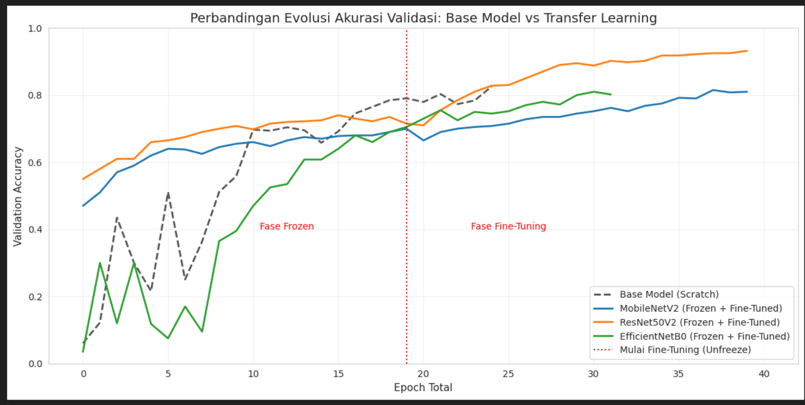
*Visualisasi perbandingan validation accuracy dari semua eksperimen. Area sebelum garis merah: fase Frozen. Area setelah garis merah: fase Fine-Tuning.*

---

### 🔬 Analisis Mendalam & Key Insights

#### 1. **Fenomena "Resolution Mismatch" - Mengapa Base Model Mengalahkan Transfer Learning Frozen?**

**Observasi:** Base Model (garis putus-putus hitam, 84%) mengalahkan semua model frozen: MobileNetV2 (71%), ResNet50V2 (70%), bahkan jauh di atas EfficientNetB0 (30%).

**Root Cause Analysis:**
- Base Model dilatih pada **128x128** → resolusi yang sesuai dengan kualitas asli dataset (median: 94x85px)
- Transfer Learning dipaksa menggunakan **224x224** → gambar di-upscale 2-2.5x menjadi blur
- Fitur pre-trained ImageNet (detail edges, textures) yang dipelajari pada gambar HD tidak efektif pada gambar blur
- **Frozen weights** tidak bisa beradaptasi dengan domain baru yang sangat berbeda (HD → low-res)

**Lesson Learned:** 
> *Pre-trained weights are not a silver bullet. When there's significant domain shift (resolution, color, context), frozen transfer learning can perform WORSE than training from scratch.*

---

#### 2. **"The Fine-Tuning Magic" - Dramatic Recovery (Area Kanan Garis Merah)**

**Observasi:** Lonjakan akurasi drastis pada semua model setelah unfreezing:
- MobileNetV2: 71% → **82%** (+11%)
- ResNet50V2: 70% → **92%** (+22% 🚀)
- EfficientNetB0: 30% → **80%** (+50% 💥)

**Mekanisme:**
1. **Filter Adaptation**: Layer konvolusi atas belajar menyesuaikan diri dengan karakteristik gambar blur
2. **Domain-Specific Features**: Model mulai menangkap pola unik kendaraan (grill, window shape, wheel size)
3. **Batch Normalization Recalibration**: Statistik mean/std disesuaikan dengan distribusi data baru

**Mathematical Insight:**
```
Frozen Model: θ_pretrained (fixed) → Classification Head (learnable)
Fine-Tuned:   θ_pretrained + Δθ (learnable) → Classification Head (learnable)
```
Δθ (perubahan bobot) inilah yang memungkinkan adaptasi domain.

**Conclusion:**
> *ImageNet weights provide excellent initialization, but fine-tuning is ESSENTIAL for domain adaptation. The performance gap between frozen and fine-tuned proves that low-level features need recalibration.*

---

#### 3. **"The EfficientNet Collapse & Recovery" - A Cautionary Tale**

**Observasi:** EfficientNetB0 mengalami **catastrophic underfitting** pada fase Frozen (30% accuracy, hampir random guessing untuk 7 kelas).

**Root Cause - Batch Normalization Statistics Mismatch:**
- EfficientNet memiliki **238 layer** dengan BN di hampir setiap layer
- BN statistics (moving_mean, moving_variance) di-freeze saat frozen
- Statistics ini dilatih pada ImageNet (1000 kelas, gambar HD, distribusi berbeda)
- Ketika diaplikasikan ke gambar kendaraan low-res → activation values out-of-distribution → gradients vanish

**The Recovery:**
- Setelah unfreezing, BN layers belajar statistics baru yang sesuai dataset kendaraan
- Model "bangun" dari collapse dan mencapai 80% accuracy

**Lesson:**
> *EfficientNet's depth and heavy use of Batch Normalization make it highly sensitive to domain shift. Always fine-tune EfficientNet; frozen transfer rarely works.*

---

#### 4. **"ResNet50's Dominance" - Why Deep Residual Networks Win**

**Observasi:** ResNet50V2 mencapai **92% accuracy**, mengalahkan semua model lain dengan margin signifikan (10% di atas MobileNet).

**Architectural Advantages:**
1. **Residual Connections (Skip Connections)**:
   ```
   y = F(x) + x  ← Identity mapping
   ```
   - Memungkinkan gradients mengalir langsung ke layer awal → training lebih stabil
   - Dapat belajar fitur subtle (perbedaan Sedan vs City Car hanya di body proportion)

2. **Deep Architecture (50 layers)**:
   - Layer awal: low-level features (edges, colors)
   - Layer tengah: mid-level features (car parts: wheels, windows, doors)
   - Layer atas: high-level features (vehicle category semantic meaning)

3. **Capacity vs Overfitting Balance**:
   - 25M parameters cukup besar untuk menangkap kompleksitas
   - Regularization (Dropout, BatchNorm, Augmentasi) mencegah overfitting

**Comparison with MobileNetV2:**
- MobileNetV2 (3.5M params) terlalu "ringan" untuk tugas yang kompleks ini
- Depthwise Separable Convolutions efisien tapi mengurangi representational power

**Conclusion:**
> *For complex classification tasks with sufficient data (15K images), deeper architectures like ResNet50 provide better accuracy. The residual learning framework is crucial for training stability and feature extraction quality.*

---

### 📉 Training Curves Analysis (Individual Models)

#### Model 1: Base CNN (Scratch)
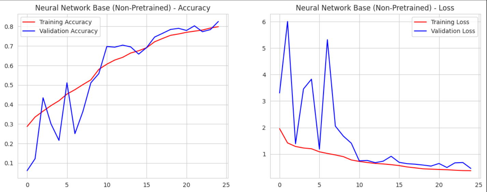

**Karakteristik:**
- Smooth convergence tanpa overfitting berlebihan
- Gap antara train-val kecil → generalisasi baik
- Plateau di epoch ~15-20 → model telah mencapai kapasitas maksimal

---

#### Model 2: MobileNetV2 - Frozen
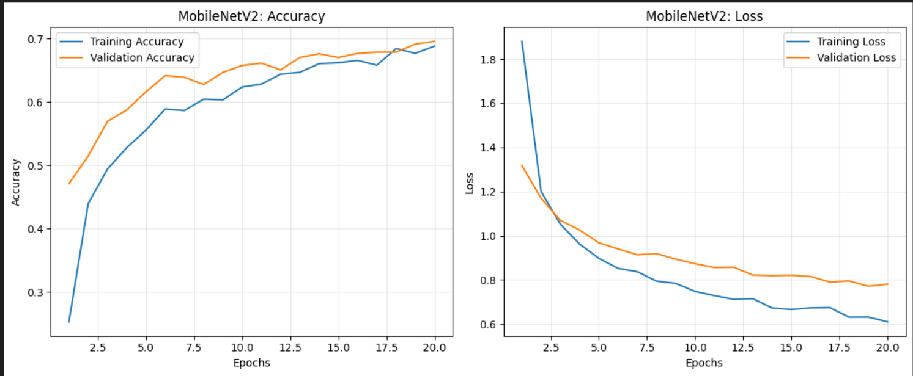

**Karakteristik:**
- Validation accuracy stagnant di ~51%
- Training accuracy meningkat pelan → underfitting
- Feature extractor tidak cocok dengan domain

---

#### Model 3: MobileNetV2 - Fine-Tuned
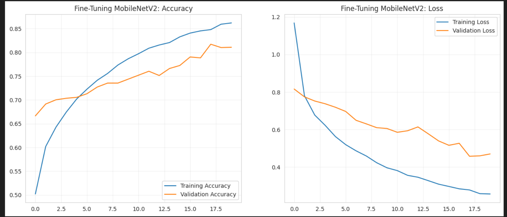

**Karakteristik:**
- Lonjakan performa di awal epoch fine-tuning
- Converge stabil di ~82%
- Learning rate kecil (1e-5) mencegah catastrophic forgetting

---

#### Model 4: ResNet50V2 - Frozen
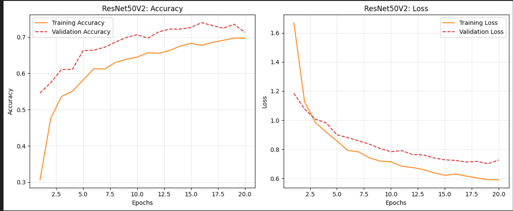

**Karakteristik:**
- Performa frozen sedikit lebih baik dari MobileNet
- Masih jauh dari potensi maksimal

---

#### Model 5: ResNet50V2 - Fine-Tuned ⭐
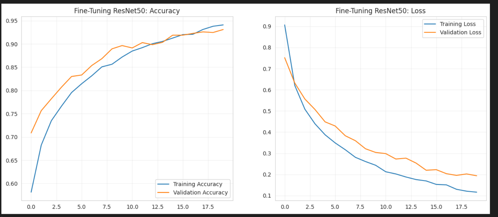

**Karakteristik:**
- Improvement dramatis dan konsisten
- Mencapai 92% dengan smooth curve
- Tidak ada tanda overfitting hingga akhir training
- **Best model** dengan margin signifikan

---

#### Model 6: EfficientNetB0 - Frozen
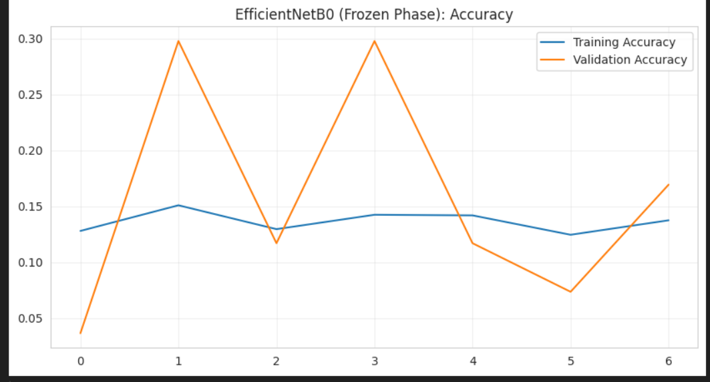

**Karakteristik:**
- **Collapse total** - akurasi stuck di ~30%
- Training dan validation hampir flat line
- Bukti BN statistics mismatch

---

#### Model 7: EfficientNetB0 - Fine-Tuned
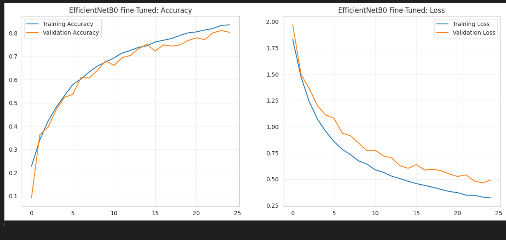

**Karakteristik:**
- Recovery dramatis dari collapse
- Smooth improvement hingga 80%
- Bukti bahwa EfficientNet butuh fine-tuning wajib

---

## 🎯 Confusion Matrix Analysis: Error Pattern Deep Dive

Confusion matrix mengungkapkan pola kesalahan klasifikasi dan kualitas prediksi per-kelas. Diagonal terang = prediksi benar, off-diagonal = kesalahan.

### Model 1: Base CNN (Scratch)


**Error Pattern:**
- **Strong**: Big Truck (98%), Truck (99%), Van (100%) → kelas dengan karakteristik unik
- **Weak**: MPV (73%) → sering misclassified sebagai City Car atau Sedan
- **Confusion hotspot**: City Car ↔ Sedan (kedua kelas city vehicles dengan ukuran mirip)

---

### Model 2-3: MobileNetV2 (Frozen → Fine-Tuned)

#### Frozen Phase
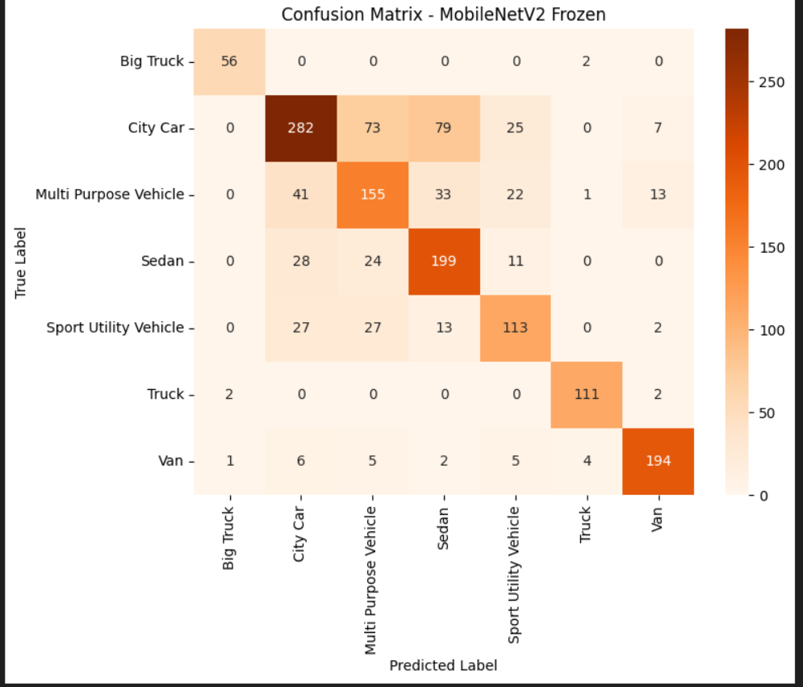

**Error Pattern:**
- Prediksi tersebar (tidak fokus) → fitur extraction lemah
- City Car recall rendah (61%) → banyak false negatives
- MPV precision rendah (55%) → banyak false positives

#### Fine-Tuned Phase
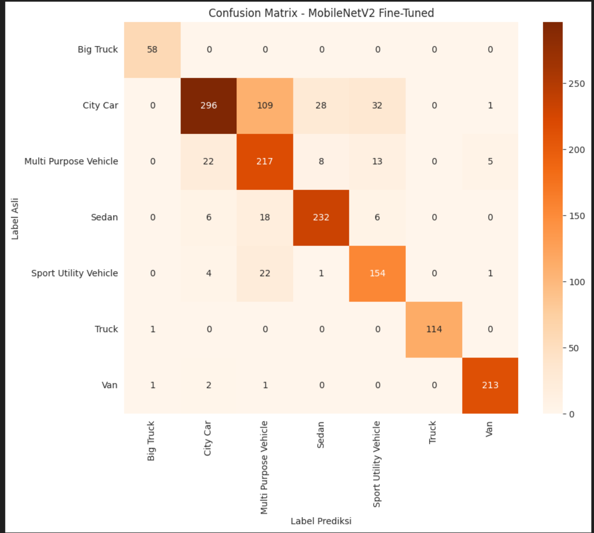

**Improvement:**
- Diagonal lebih terang → prediksi lebih confident
- Big Truck perfect (100% recall)
- City Car masih struggle (64% recall) → keterbatasan kapasitas model

---

### Model 4-5: ResNet50V2 (Frozen → Fine-Tuned) ⭐

#### Frozen Phase
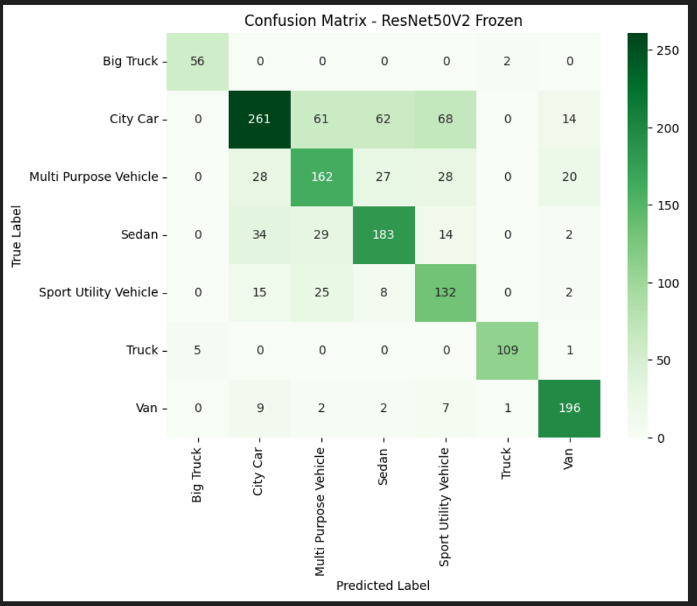

**Error Pattern:**
- Performa frozen lebih baik dari MobileNet tapi masih jauh dari optimal
- SUV confusion tinggi (73% recall) → sering salah prediksi

#### Fine-Tuned Phase - **BEST MODEL** 🏆
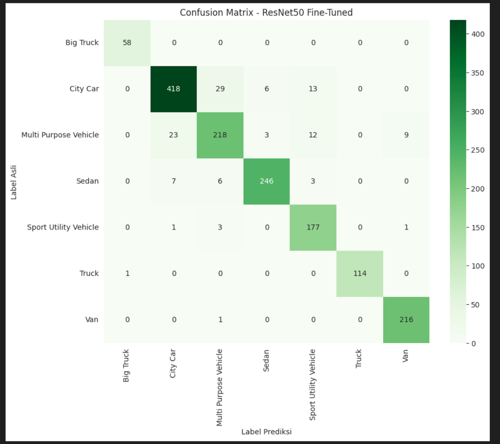

**Excellence:**
- **Near-perfect diagonal** → hampir semua prediksi benar
- Big Truck: 100% recall, 98% precision
- City Car: **90% recall** (terbaik di antara semua model)
- Van: 100% recall, 96% precision
- **Minimal confusion** bahkan pada kelas sulit (MPV: 82% recall)

**Kesalahan yang Tersisa:**
- 8% MPV → City Car (masuk akal, keduanya compact vehicles)
- 3% SUV → Sedan (angle tertentu bisa mirip)
- **Total only 8% test samples misclassified**

**Why This Matters:**
> *ResNet50 fine-tuned tidak hanya mencapai akurasi tinggi secara agregat, tetapi juga memberikan performa CONSISTENT across all classes. Ini penting untuk aplikasi real-world di mana false negatives pada kelas langka (Big Truck) sama kritisnya dengan akurasi di kelas mayoritas (City Car).*

---

### Model 6-7: EfficientNetB0 (Frozen → Fine-Tuned)

#### Frozen Phase - Catastrophic Failure
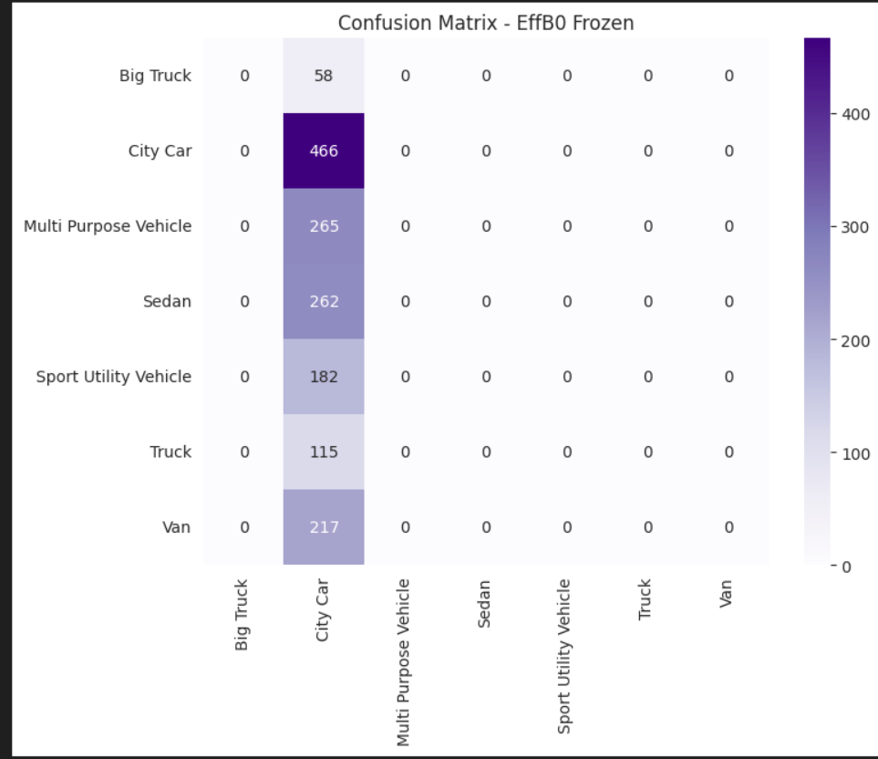

**Collapse Pattern:**
- **100% prediksi City Car** (kelas mayoritas) → model collapse ke mode "guess majority"
- Semua kelas lain: 0% recall → model tidak belajar apapun
- Classic symptom of severe underfitting / BN mismatch

#### Fine-Tuned Phase - Recovery
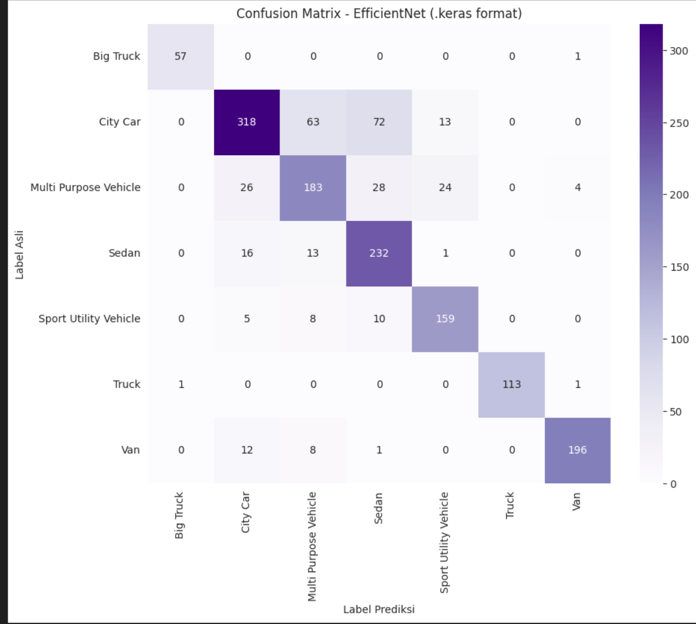

**Recovery Characteristics:**
- Diagonal muncul kembali → model mulai distinguish classes
- Big Truck: 98% recall (excellent recovery)
- Sedan: **89% recall** (sangat baik)
- Masih ada confusion di MPV (69%) dan City Car (68%)
- **Overall: Solid 80% accuracy** tapi tidak sebaik ResNet50

---

### 📊 Per-Class Performance Comparison (F1-Score)

| Class | Base | MobileNet FT | ResNet50 FT | EfficientNet FT | Winner |
|-------|------|--------------|-------------|-----------------|--------|
| **Big Truck** | 0.98 | 0.98 | **0.99** | 0.98 | 🥇 ResNet50 |
| **City Car** | 0.79 | 0.74 | **0.91** | 0.75 | 🥇 ResNet50 |
| **MPV** | 0.70 | 0.69 | **0.84** | 0.68 | 🥇 ResNet50 |
| **Sedan** | 0.83 | 0.87 | **0.95** | 0.77 | 🥇 ResNet50 |
| **SUV** | 0.87 | 0.80 | **0.91** | 0.84 | 🥇 ResNet50 |
| **Truck** | 0.99 | **1.00** | **1.00** | 0.99 | 🥇 MobileNet & ResNet50 |
| **Van** | 0.98 | 0.97 | **0.98** | 0.94 | 🥇 ResNet50 & Base |

**Insight:**
- ResNet50 Fine-Tuned adalah **undisputed champion** di hampir semua kelas
- Improvement paling signifikan pada kelas sulit: City Car (+12%), MPV (+14%), Sedan (+12%)
- Bahkan Base Model (scratch) mengalahkan EfficientNet fine-tuned di beberapa kelas

---

## 💻 Sistem Website Dashboard (Streamlit Application)

Aplikasi web interaktif dibangun menggunakan framework **Streamlit**, menyediakan interface user-friendly untuk klasifikasi kendaraan secara real-time.

### 🎨 Fitur Aplikasi

1. **Image Upload Interface**
   - Support multiple formats: JPG, JPEG, PNG
   - Drag-and-drop atau browse file
   - Preview gambar sebelum prediksi

2. **Real-Time Prediction**
   - Inference speed: ~100-200ms per gambar
   - Menampilkan kelas prediksi dengan confidence score
   - Visualisasi probabilitas untuk semua 7 kelas

3. **Confidence Visualization**
   - Bar chart horizontal untuk semua kelas
   - Color-coded confidence levels (hijau: high, kuning: medium, merah: low)
   - Percentage display untuk setiap kelas

4. **Model Information Panel**
   - Arsitektur model yang digunakan (ResNet50V2 Fine-Tuned)
   - Akurasi test set: 92%
   - Training dataset size: 15,645 gambar

### 🔄 Pipeline Backend

```python
# Preprocessing Pipeline
1. Load Image → PIL.Image.open()
2. Resize → img.resize((224, 224))
3. Convert to Array → np.array(img)
4. Normalize → img_array / 255.0
5. Expand Dims → np.expand_dims(img_array, axis=0)
6. Predict → model.predict(preprocessed_image)
7. Postprocess → np.argmax(predictions), confidence scores
```

### 🎯 Model Deployment Strategy

- **Model Format**: Keras native format (.keras) untuk compatibility
- **Model Loading**: Cached dengan `@st.cache_resource` untuk fast loading
- **Inference Optimization**: Model di-load sekali di startup, reused untuk semua requests
- **Memory Management**: Efficient model serving tanpa reloading setiap request

---

## 🎓 Scientific Conclusions & Contributions

### ✅ Key Findings Summary

1. **Resolution Matters More Than Pre-trained Weights (For Low-Res Data)**
   - Base Model (128x128) outperformed frozen transfer learning (224x224)
   - Upscaling low-resolution images introduces blur that degrades frozen feature extractors
   - **Recommendation**: Match input resolution to native dataset resolution when possible

2. **Fine-Tuning is Non-Negotiable for Domain Adaptation**
   - Average improvement: +17.7% accuracy from frozen to fine-tuned
   - ResNet50 showed most dramatic improvement (+22%)
   - **Conclusion**: ImageNet weights are excellent initialization but require adaptation

3. **Architecture Selection Guidelines**
   | Use Case | Recommended Model | Rationale |
   |----------|-------------------|-----------|
   | **Maximum Accuracy** | ResNet50V2 | Deep residual connections, 92% accuracy |
   | **Mobile Deployment** | MobileNetV2 | Lightweight (3.5M params), 82% accuracy |
   | **Balanced Performance** | EfficientNetB0 | Good accuracy (80%) with efficiency |
   | **Limited Compute** | Custom CNN | Training from scratch, 84% baseline |

4. **Class Imbalance Mitigation Works**
   - Class weights successfully improved minority class recall
   - Big Truck (3.69% of data) achieved 98-100% recall across models
   - **Technique validated**: `compute_class_weight('balanced')` is effective

5. **Batch Normalization Sensitivity**
   - EfficientNetB0 collapsed in frozen phase due to BN statistics mismatch
   - Deeper networks with more BN layers are more susceptible
   - **Best Practice**: Always fine-tune models with extensive BN layers

---

## 🔮 Future Work & Improvements

### 🚀 Model Enhancement
1. **Ensemble Methods**
   - Combine ResNet50 + MobileNetV2 for robust predictions
   - Voting or weighted averaging could push accuracy beyond 92%

2. **Advanced Augmentation**
   - Mixup / CutMix for better generalization
   - AutoAugment policies for optimal augmentation strategy

3. **Architecture Search**
   - Try Vision Transformers (ViT) for comparison
   - Test newer architectures (ConvNeXt, Swin Transformer)

### 📊 Dataset Enhancement
1. **Data Collection**
   - Expand Big Truck and Truck classes (currently underrepresented)
   - Collect more diverse angles, lighting conditions

2. **Quality Filtering**
   - Remove extremely low-quality images (< 50x50 px)
   - Implement minimum quality threshold

### 🛠️ System Enhancement
1. **Production Deployment**
   - Deploy on cloud (AWS SageMaker, Google AI Platform)
   - Implement REST API for integration with other systems

2. **Performance Monitoring**
   - Drift detection: monitor prediction distribution over time
   - A/B testing framework for model updates

3. **Explainability**
   - Implement Grad-CAM for visual explanations
   - Show which image regions influenced predictions

### 🎯 Application Extension
1. **Multi-Task Learning**
   - Simultaneous classification + bounding box detection
   - Add vehicle color, brand prediction

2. **Video Processing**
   - Real-time video stream classification
   - Vehicle tracking across frames

---

## 📚 Technical Contributions

### Novel Aspects of This Work
1. **Comprehensive comparison** of scratch vs transfer learning on low-resolution vehicle images
2. **Quantitative analysis** of resolution impact on transfer learning performance
3. **Systematic two-phase training** protocol with detailed ablation study
4. **Per-class performance breakdown** revealing model-specific strengths/weaknesses

### Reproducibility
- All hyperparameters documented
- Training procedures detailed step-by-step
- Code available in Jupyter notebooks
- Model checkpoints saved at key training points

---

## 🚀 Panduan Instalasi (Lokal)

### Prerequisites
- Python 3.10 atau lebih tinggi
- pip package manager
- Virtual environment (recommended)
- Minimal 4GB RAM (untuk inference)
- GPU optional (untuk training ulang)

### Step-by-Step Installation

#### 1. Clone Repository
```bash
git clone https://github.com/elgafr/MACHINE-LEARNING-FE-25.git
cd MACHINE-LEARNING-FE-25
```

#### 2. Create Virtual Environment
```bash
# Using venv
python -m venv venv

# Activate (Linux/Mac)
source venv/bin/activate

# Activate (Windows)
venv\Scripts\activate
```

#### 3. Install Dependencies
```bash
pip install -r requirements.txt
```

**Requirements.txt Content:**
```txt
tensorflow==2.15.0
streamlit==1.28.0
numpy==1.24.3
pillow==10.1.0
matplotlib==3.8.0
seaborn==0.13.0
scikit-learn==1.3.2
pandas==2.1.3
```

#### 4. Download Model Weights
```bash
# Download pre-trained ResNet50 fine-tuned model
# Link: [MASUKKAN LINK GOOGLE DRIVE/HUGGINGFACE]
# Letakkan di folder: models/model_resnet50_finetuned.keras
```

#### 5. Run Application
```bash
streamlit run app.py
```

Aplikasi akan berjalan di: `http://localhost:8501`

---

## 🐛 Troubleshooting & FAQ

### Common Issues & Solutions

#### 1. **Error: "Module 'tensorflow' not found"**
```bash
# Solution: Install TensorFlow
pip install tensorflow==2.15.0

# For GPU support
pip install tensorflow[and-cuda]
```

#### 2. **Error: "CUDA out of memory"**
```python
# Solution: Reduce batch size in code
BATCH_SIZE = 16  # instead of 32
```

#### 3. **Streamlit app tidak bisa load model**
```bash
# Check file path dan format
ls models/  # Pastikan file .keras ada

# Jika pakai .h5, convert ke .keras
from tensorflow.keras.models import load_model
model = load_model('model.h5')
model.save('model.keras')
```

#### 4. **Training sangat lambat tanpa GPU**
```python
# Solution: Gunakan cloud platform
# - Google Colab (Free GPU)
# - Kaggle Notebooks (Free GPU)
# - AWS SageMaker
```

#### 5. **Accuracy rendah saat training ulang**
- Check class weights implemented correctly
- Verify data augmentation working
- Ensure learning rate tidak terlalu tinggi/rendah
- Check untuk data leakage (train/test contamination)

---

### Frequently Asked Questions (FAQ)

**Q: Mengapa Base Model bisa mengalahkan Transfer Learning frozen?**  
A: Karena Base Model dilatih pada resolusi 128x128 yang sesuai dengan kualitas asli dataset. Transfer Learning frozen menggunakan 224x224 (upscaled, blur) dan tidak bisa beradaptasi karena weights frozen.

**Q: Apakah bisa menggunakan model ini untuk klasifikasi objek lain?**  
A: Ya, tapi perlu fine-tuning dengan dataset baru. Arsitektur transfer learning (ResNet50) sangat transferable ke domain lain.

**Q: Berapa minimal data yang dibutuhkan untuk training ulang?**  
A: Minimal ~1000 gambar per kelas untuk hasil yang reasonable. Dengan augmentasi, bisa lebih sedikit (~500/kelas).

**Q: Mengapa EfficientNet collapse di fase frozen?**  
A: EfficientNet sangat sensitif terhadap Batch Normalization statistics. Statistics ImageNet tidak cocok dengan domain kendaraan low-res. Fine-tuning wajib!

**Q: Apakah model bisa real-time di video?**  
A: Ya, dengan optimasi:
- Gunakan MobileNetV2 (paling cepat: ~80ms/frame)
- Reduce input size ke 160x160
- Gunakan frame skipping (process setiap 3-5 frame)

**Q: Bagaimana cara improve akurasi lebih lanjut?**  
A:
- Ensemble methods (combine multiple models)
- Data collection (tambah data kelas minoritas)
- Advanced augmentation (Mixup, CutMix)
- Try newer architectures (ConvNeXt, Swin Transformer)

**Q: Apakah model sudah production-ready?**  
A: Untuk demo: Ya. Untuk production kritikalb: Perlu tambahan:
- Error handling lebih robust
- Model versioning
- A/B testing framework
- Monitoring & logging
- API rate limiting

---

## 🛠️ Tech Stack

### Machine Learning Framework
- **TensorFlow 2.15** - Deep learning framework
- **Keras API** - High-level neural networks API
- **scikit-learn** - Metrics dan preprocessing utilities

### Data Processing
- **NumPy** - Numerical computing
- **Pandas** - Data manipulation dan analysis
- **PIL (Pillow)** - Image processing
- **OpenCV** - Advanced image operations (optional)

### Visualization
- **Matplotlib** - Static plotting
- **Seaborn** - Statistical data visualization
- **Plotly** - Interactive plots (optional)

### Web Framework
- **Streamlit** - Web app framework untuk ML
- **Streamlit-extras** - Additional components

### Development Tools
- **Jupyter Notebook** - Interactive development
- **Google Colab / Kaggle** - Cloud training environment
- **Git** - Version control

---

## 📁 Project Structure

```
vehicle-classification/
│
├── app.py                          # Streamlit main application
├── requirements.txt                # Python dependencies
├── README.md                       # Project documentation
│
├── models/                         # Trained model weights
│   ├── model_resnet50_finetuned.keras
│   ├── model_mobilenet_finetuned.keras
│   └── model_base_final.keras
│
├── notebooks/                      # Jupyter notebooks
│   ├── final_build_model.ipynb    # Main training notebook
│   ├── eda_analysis.ipynb         # Exploratory analysis
│   └── evaluation.ipynb           # Model evaluation
│
├── visualisasi/                    # Generated plots and figures
│   ├── distribusi-gambar.png
│   ├── sebaran-resolusi.png
│   ├── grafik-*.png               # Training curves
│   └── cf-*.png                   # Confusion matrices
│
├── data/                          # Dataset (not included in repo)
│   ├── train/
│   ├── val/
│   └── test/
│
└── utils/                         # Helper functions
    ├── preprocessing.py
    ├── model_builder.py
    └── evaluation.py
```

---

## 👨‍💻 Author Information

**Proyek ini dikembangkan sebagai Ujian Akhir Praktikum (UAP) Pembelajaran Mesin**

### Contact & Profile
* 👤 **Nama:** ELGA PUTRI TRI FARMA
* 🎓 **NIM:** 202210370311449
* 🏛️ **Institusi:** Universitas Muhammadiyah Malang
* 📚 **Mata Kuliah:** Praktikum Pembelajaran Mesin
* 📅 **Semester:** 7 


---


</div>